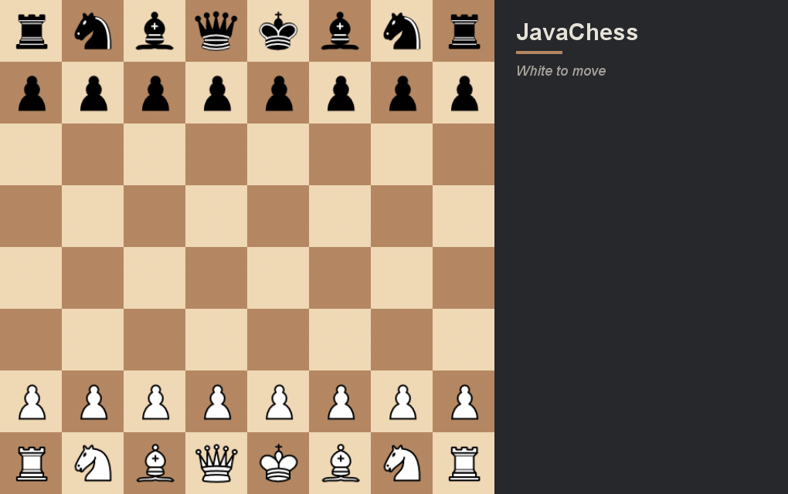

# JavaChess

JavaChess is a desktop chess game written in Java with a built-in chess engine. You can play against the computer at three difficulty levels or against another person on the same board, and the engine also runs on its own inside any standard chess GUI through the UCI protocol.

Play in your browser: https://archie0099.github.io/JavaChess/



## Features

- **Play modes:** Human vs Human, or Human vs the engine playing White or Black, at Easy, Medium, or Hard.
- **Search engine:** negamax with alpha-beta and principal variation search, a transposition table, null-move pruning, late-move reductions, killer and history move ordering, check extensions, and a quiescence search that resolves captures and checks.
- **Evaluation:** tapered piece-square tables, mobility, pawn structure, rook and bishop terms, king safety, and an endgame term that drives a lone king to the edge to convert won endings.
- **Opening book:** built-in lines covering the main openings, plus extra lines loaded from openings.txt.
- **Full rules:** castling, en passant, promotion, the 50-move rule, threefold repetition, and insufficient-material draws.
- **UCI support:** run the engine in Arena, CuteChess, or any UCI GUI. It streams depth, score, and the principal variation while it thinks, and announces forced mates.
- **Swing interface:** the engine searches on a background thread so the window never freezes, with a move list in algebraic notation, last-move and legal-move highlighting, and undo and redo.

## Getting started

You need Java 17 or newer. From the `src` folder:

```
javac *.java
java ChessGUI
```

That opens the game window. Choose a mode and a difficulty and start playing. Click a piece to see its legal moves, then click a target square to move.

To use it as a UCI engine, point your chess GUI at a launcher that runs `java UCI` from the `src` folder. On Windows you can add JavaChess.bat as an engine in Arena under Engines, then Install New Engine.

The browser version runs this same code, compiled to a jar and executed with CheerpJ; see `docs/`.

## How it works

The project keeps two board representations. The graphical game uses an object board (`Game`, `Board`, and the piece classes) that holds the rules of record for legality, check, and draws. The engine uses a separate fast board (`SearchBoard`) with integer-encoded pieces, make and unmake moves, and an incremental Zobrist hash, which lets it search much deeper in the same time. The two boards were cross-checked against each other on tens of thousands of positions to confirm they agree on every legal move and check, and the fast board passes the standard perft move-generation suite exactly.

There is no framework and no build step beyond `javac`, and there are no external libraries.

## Layout

- `src/` holds all the Java source, the piece images, the opening book, and the UCI launcher.
- `docs/` holds the browser version (the CheerpJ page and the packaged jar) and the demo GIF.

## Tests

From the `src` folder:

```
javac *.java
java Perft             # move generation against the standard perft suite
java CrossCheck 300    # object board vs fast board agreement over random games
java BookCheck         # every built-in opening line replays legally
java SANTest           # algebraic notation (O-O, exd6, Nbd2, Qh4#, b8=Q+)
java CheckmateTester   # forced mates: queen, rook, two rooks, two bishops vs king
java EngineMatch 4 250 # the current engine against the earlier version
```
